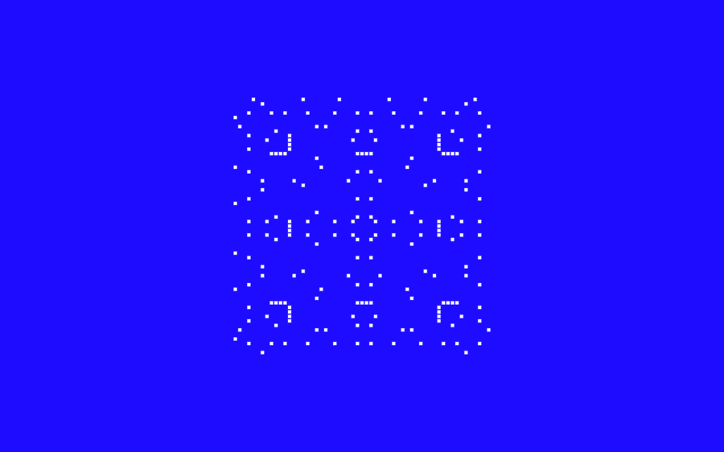
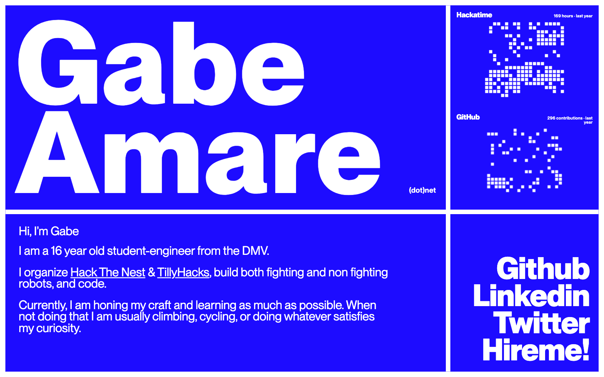
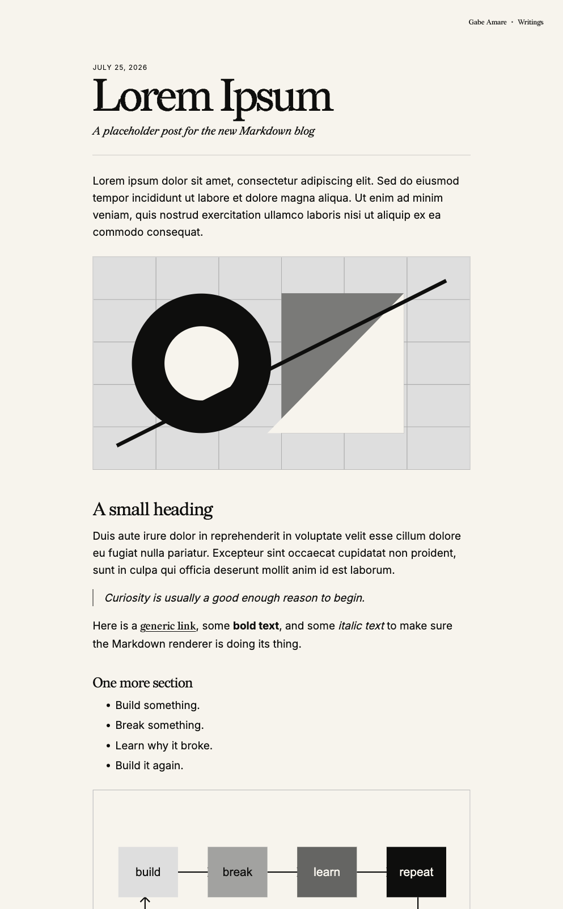

# gabeamare(dot)net

this is my personal site.

it is a site, with stuff on it, im going to write a few blogs like soon as in next week or so, so pretty lit



<details>
  <summary>the still frames</summary>
  <br />
  
  <br /><br />
  
</details>

## details

- the landing page is an electric-blue panel grid set in PP Neue Montreal. the writings still use Redaction and Inter.
- GitHub and Hackatime activity is live, rendered as binary WebGL grids, and clickable from one year down to one week
- the loading field is drawn from quadratic residues on canvas; `/loaders` has the two live studies
- writings are just Markdown files in [`content/writings`](content/writings)
- drafts are real drafts: written and hidden, codex made a fun little 404 without asking me, I lowk rock with it so yeh.
- Design is me, all me. implementation was all codex.

## run it

```bash
npm install
npm run dev
```

then pull up [localhost:3000](http://localhost:3000).

## write something

drop a `.md` file into `content/writings`:

```md
---
title: "Post title"
subtitle: "A short description"
date: "2026-07-25"
draft: true
---

Write the post here.
```

the filename becomes the URL, so `my-post.md` lives at `/writings/my-post`.
flip `draft` to `false` whenever it deserves to see daylight.

typography is automatic: prose gets Inter, headings get Redaction 10, and links
get Redaction 35. start sections with `##`; the page title comes from the
frontmatter.

## built with

[Next.js](https://nextjs.org/) · [React](https://react.dev/) ·
[TypeScript](https://www.typescriptlang.org/) · Markdown · unhealthy curiosity

made by [gabe](https://github.com/ksgat).

# credit where its due

I am using Shymikes hackatime for data, and then rendering myself so yeah check his stuff out hes tuff: shymike.dev, github.com/Imshymike.
